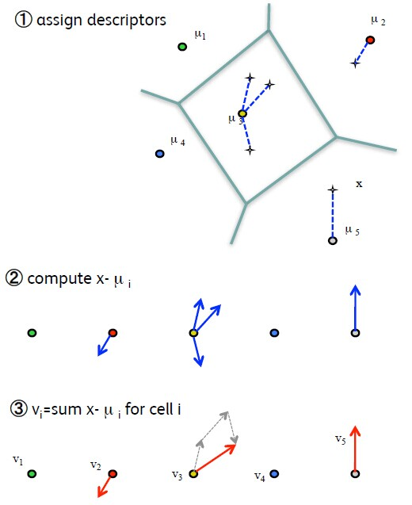

# CBIR 综述

## 最常引述的方法分类
* 常用检索词：
  * locality sensitive hashing，ITQ，product quantization，inverted multi-index，笛卡尔k-means，hamming embedding
* 重要技术：特征提取（表示）、索引构建（存储）、近邻搜索（查找）
* 表示方法（局部特征、全局特征）
  * 特征按提取方式分为`传统特征`和`深度特征`
  * 在图像检索领域，基于CNN提取的深度特征同样也表现出远优于传统特征的效果，所以`只研究深度特征`
  * 手工特征（传统特征）：
    * SIFT（全局）、GIST（全局）、HOG、HARR
  * 深度学习特征：卷积层的输出为局部特征，FC层输出是全局特征
    * RMAC、GEM
* 存储方法（稀疏化）
  * 特征按照存储方式又分为`浮点特征`和`二进制特征`
    * 浮点特征：
      * 优点：表征图像信息，进行距离计算时能够更加细粒度地衡量图像间的差异
      * 缺点：距离计算复杂度较高，此外浮点向量在进行存储时占用空间也更大
    * 二进制特征：
      * 优点：存储更加高效，且向量间差异通常采用hamming距离衡量，计算复杂度较低
      * 缺点：距离衡量粒度较粗，如对于128维度的二级制特征，图像间差异只存在128个数值范围内
  * 浮点特征
    * 特征编码：
      * BOF(Bag Of Feature, Bag Of Visual Words, BOW)、Fisher Vector、VLAD 
      * 局部特征聚合成全局特征、量化成视觉词汇短语
      * 聚合方法的特征维度比原始特征维度更高，因此若后续对聚合后的特征进行PCA操作，会增加计算复杂度，同时还可能导致数据过拟合
    * 深度特征：
      * Sum-pooling (SPoC) 、RMAC、GEM
      * 在分类数据集上训练得到的深度特征应用于不同数据集的检索任务时仍然起作用
      * 在检索数据集上finetune分类模型，能够大幅提高检索效果
      * PCA降维应用于深度特征能够在几乎不降低检索准确率的同时有效压缩特征长度
  * 二进制特征：Embedding成二进制特征（`也属于向量优化`）
    * spectral hashing、sigmoid 0.5 hard thresholding
    * 将二进制特征用作减小搜索空间的一种方式，采用`多级查找方式`：首先对查询图像与目标数据库中的图像的二进制特征进行汉明距离计算，选取top N距离对应的图像，然后再进行浮点向量间的距离计算，优化查找准确率
    * `汉明距离`：两个等长字符串之间的汉明距离是两个字符串对应位置的不同字符的个数。换句话说，它就是将一个字符串变换成另外一个字符串所需要替换的字符个数
* 查找方法（通常：查找优化+向量优化）
  * 查找优化
    * 倒排索引，优化检索结构，不改变向量本身。`通过减小搜索空间，提高检索效率`
      * 特征量化可以过滤特征本身的噪声，使得相似的特征能够被匹配到，但是也会引入量化噪声
      * 因此建立量化器时（聚类），选取合适的类簇数K非常重要：
        * 当K较小时，查找索引的复杂度较低，但是倒排列表包含候选元素较多，进行距离重排序的复杂度较高，同时量化噪声较大；
        * 当K较大时，查找索引的复杂度较大，但进行距离重排序的复杂度较低，量化噪声也较小。
      * `以每个维度作为索引可以避免量化误差，也拥有Hash方法的优势，能快速找到Key`
    * NN 最近邻查找
      * K-D Tree：高维空间K-D树查找效率低效，复杂度近似等于蛮力搜索O(nD)
      * 优点：穷尽搜索，总能返回与查询值最相近的结果
      * 缺点：复杂度高
    * ANN 近似最近邻查找 
      * LSH、汉明编码、倒排多索引(IMI)（`将PQ应用于索引构建和查找的过程`）、针对深度特征的IMI（No-IMI）、HKM（Hierachical K-Means）
      * 优点：如果距离测量准确地捕捉到查询所关注的核心内容，那么距离的细微差别就不重要了
      * 缺点：返回结果的质量可能严重差于真实最近邻查找返回的匹配结果（所以BaseLine为NN）
  * 向量优化
    * `进行向量重映射`，将高维浮点向量映射为低维向量，或者映射到汉明空间，映射后的向量可以采用更高效的方式进行距离计算
    * PQ（`优化特征向量，降低距离计算复杂度`）

## 存储方法详解

* `特征编码：用来将局部特征聚合生成更强可辨识性的图像特征。这些方法通常会生成比原始局部特征更高维度的向量，尽管如此，Embedding后的向量维度也远远低于BoF的维度`

* BOF

  * 核心思想：
    * 提取出局部向量（视觉词汇）后利用聚类的方法训练一个视觉字典，随后每幅图片用视觉词汇在视觉字典中各中心向量出现的次数来表示该图片
  * 缺点：
    * 数据量很大的情况下，由于vocabulary大小的限制，BOF的特征表达会越来越粗略（视觉字典不够完整）
    * BOF只用离特征点`最近的一个聚类中心`代替该特征点，损失较多信息。
    * 搜索效率降低，图像表示占用的内存巨大（Query时得为每个局部向量确定视觉词汇，即找到聚类中心，词表很大的情况下很慢）

* Fisher Vector

  * 核心思想：
    * 对于两幅不同的输入图像，其特征点的分布可能是相同的，但是其`变化方向（梯度）相同的概率非常小`，因此可以用分布的梯度来更加准确地表示输入图像
    * 利用高斯混合模型(GMM)，通过计算高斯混合模型中的均值、协方差等参数来表示每张图像
    * 质心数k通常取16～256即可得到较好的效果
  * 优点：
    * 准确度高
  * 缺点：
    * 计算量大（查询时依旧大）
    * 用所有`聚类中心 ( Gussian ) 的线性组合`来表示特征点，但是用GMM建模的过程中也有损失信息

* VLAD

  * 核心思想：

    

    * 一种简化的FV，其主要方法是通过聚类方法训练一个小的视觉字典
    * 对于每幅图像中的局部特征找到最近的聚类中心（视觉词汇），随后所有特征与聚类中心的差值做累加，得到一个 k x d 的 VLAD 矩阵，其中k是聚类中心个数，d是特征维数 (如sift是128维)
    * 随后将该矩阵扩展为一个(k*d)维的向量，并对其L2归一化，所得到的向量即为VLAD

  * 优点：

    * 可以理解为BOF和Fisher Vector的折中, VLAD保存了每个特征点到离它`最近`的聚类中心的距离，并且像Fisher Vector 考虑了特征点的`每一维`的值。
    * 相比BoF，准确率更高，便于降维（PCA），同时降维对于准确率的影响也较小

* Triangular embedding

* SPoC

  * 核心思想：
    * 最后一个卷积层CxHxW，每个Channel上Sum得到长度为C的向量
    * 核心信息在图像中央：Sum时乘上位置稀疏（Gussian得到）
    * PCA白化、去相关性或降维，L2归一化
  * 优点：
    * 累加求和生成的聚合特征SPoC的检索效果优于使用VLAD，Fisher Vector和Triangular embedding等方法得到的聚合特征的检索效果
    * 深度卷积特征与传统特征的分布特性不同，前者比后者具有更高的可辨识性，因此可以无需使用面向传统特征的聚合方法VLAD、Fisher Vector、Triangular embedding

* RMAC

  * 核心思想：
    * 最后一个卷积层上取Region，每个Region用RoiPooling后得到长度为Region数量的向量，Sum所有Region，L2，PCA，L2

## 查找方法详解

* LSH
  * 核心思想：
    * 通过hash function映射变换操作，将原始数据集合分成了多个子集合
    * 每个子集合中的数据间是相邻的且该子集合中的元素个数较小
    * 将一个在超大集合内查找相邻元素的问题转化为了在一个很小的集合内查找相邻元素的问题，显著减少了计算量
    * 构建一个hash table可能需要一个或多个hash function。hash function需要满足两个条件：
      * 如果d(x,y) <= d1, 则 h(x)=h(y) 的概率至少为p1;
      * 如果d(x,y) >= d2, 则 h(x)=h(y) 的概率至多为p2;
    * 包括离线建立索引和在线查找两个过程
      * 建立索引：确定hash table的个数以及每个hash table包含的hash function个数，和具体采用哪种hash function，将目标数据库中的所有数据经过hash function映射到hash table的桶内
      * 在线查找：将查询数据映射到相应桶内和计算与相应桶内的数据的距离
  * 缺点：Hash函数很难确定，Hash后的Key值也不够完整
* 汉明编码
  * 核心思想：
    * 在传统量化基础上将向量embedding到binary空间，使用hamming距离阈值，减小重排序候选列表的长度
    * HE使用粗量化器q(x)和细量化器b(x)，二级量化的方式
      * 粗量化器基于聚类的量化方式，质心数k较小，粒度较粗
      * 细量化器使用投影矩阵将浮点向量embed到二进制向量，投影矩阵使用训练数据学习得到
      * $x_i \rightarrow q(x_i) \rightarrow z(x_i) \rightarrow b(x_i)$, 粗粒度、细粒度投影、阈值二进制
      * $ z_i = P{x_i} $,  P是高斯矩阵QR分解里Q的前 $d_b$ 行
      * 细粒度后，每个簇的中值向量 $ \tau_l $ 作为该簇向量转为二进制的阈值向量，大于阈值的位置为1，否则为0
    * 为了提高几何仿射变换的检索稳定性，HE论文还提出一种weak geometrical consistency的方式，该方式结合到倒排索引的构建过程中，可以高效执行
  * 缺点：数据量增长的环境下，聚类不适用，视觉词汇可能不够全
* 倒排多索引(IMI)
  * 核心思想：
    * 采用乘积量化（PQ）的思想构建多索引结构来优化重排序搜索空间
    * 传统倒排索引的存在形式是一维数据，而倒排多索引结构的索引用一个多维度的table
    * IMI将PQ应用于索引构建和查找的过程
      * 构建索引：x = [x1, x2]，子向量分别聚类，每个类别K个词
      * 查询时：q = [q1, q2]，每个词表返回list按距离从小到大排序，距离Sum后取Top T（multi Sequence算法，用到优先队列，向下，向右bfs扩展入队），在Top里的向量取交集作为候选集
      * Re-Ranking时可以结合其它快速相似度计算的方法，如PQ
  * 优点：
    * 使用倒排多索引结果进行检索时，返回的候选倒排列表更短，同时候选元素与查询单词距离更近，召回率更高
  * 缺点：
    * 倒排多索引table可以是二维或者更高维度，维度越高，reranking 搜索空间粒度越细，存储开销也越大，需在存储空间、检索时间以及检索准确性能之间能达到较好的平衡（2D）
    * IMI索引方法的需要保证特征向量划分后的多个数据集是不相关的，对于传统特征如SIFT是满足该条件的，而`深度特征并不具备上述可分条件`，划分后的数据空间具有较强相关性
* 针对深度特征的IMI（No-IMI）
  * 核心思想：
    * 一种非正交的IMI索引方法
    * NO-IMI包括两个码表，S和T，每个码表的包含K个码字
      * S称为1阶码表，为原始数据聚类生成
      * T为2阶码表，为原始数据与各对应1阶cluster的质心（S中码字）之间的`残差值`聚类生成。
    * 与IMI不同的是，NO-IMI不对向量空间划分，S和T中码字长度等于特征向量长度D
    * $ K \cdot K $单元的码字为S和T码字的和$ c_{i,j} = S_i + T_j$每个单元$ C_{i,j} $包含了距离该单元码字$ C_{i,j} $最近的所有特征向量。
    * 学习目标定义为最小化所有训练数据与其最近的cell的质心的距离的和
  * 优点：
    * 与HKM区别在于：
      * HKM的每个2级聚类是在对应1级cluster下进行的，即在运行期间需要保存K*K个向量数据
      * NO-IMI的2级聚类共享所有cluster的残差，因此只需要保存K+K个向量数据，大大节省了运行时内存占用
* 乘积量化（PQ）
  * 核心思想：
    * 解决的`重排序`时的向量间距离的快速计算的问题，用质心间的距离代替实际距离，`避免去实时计算距离`
    * 有效的前提：质心与其对应类簇的向量都足够接近
      * 假设用聚类的方式来得到质心，那么类簇数越多，质心越具有代表性
      * 极限情况下，类簇数等于数据库中向量数目（每个点都是质心），量化误差为0
    * 设要生成$2^{64}$个质心，128D分成8个子向量每个16D，每个子向量需学$ 2^{64} = (k^*)^8 = (2^8)^8$，即256个质心（`每个子向量笛卡尔积构成全部的质心`）
    * 8个质心Concat后就是最终的质心（$2^{64}$之一）
    * 距离计算：
      * SDC：对称距离计算 $d(x,y) = d(q(x),q(y))$ (均量化后的距离)
      * ADC：非对称距离计算 $ d(x,y) = d(x,q(y)) $（查询不量化与质心量化后的距离）
      * ADC比SDC多了部分运行时内存需求，但ADC未量化的查询向量进行距离计算，量化误差相比SDC更小，因此建议实际采用ADC方法
    * 检索为避免穷尽搜索，采用ADC+倒排索引（IVFADC）,采用两级量化
      * 第一级量化是一个粗粒度量化过程：直接对向量粗粒度K-means聚类，得到的码字构成了倒排索引结构中的每个节点
      * 第二级量化是`对残差向量`使用乘积量化器PQ量化（IMI是对残差向量再K-Means量化）
  * 优点：
    * PQ的量化空间非常大（质心数），可表示的向量之间的差异远远超过汉明空间能表示的向量差异。如质心数为2^64时，使用PQ方法，128维度向量的量化取值有2^64种
    * 在进行距离计算时，核心操作只包含查表和加法，大大降低了检索复杂度

## 重要问题

* 查找性能优化

## 重要的优点和特性

* 向量的稀疏性：便于构建倒排索引

## 应用场景

* 搜索引擎（Google、百度）的以图搜图功能
* 各电商网站（淘宝、Amazon、ebay）的相似商品搜索
* 社交平台（Pinterest）的相似内容推荐

# 工业界产品调研

* [`CBIR Engine List`](https://en.wikipedia.org/wiki/List_of_CBIR_engines) 

### [LIRE](http://www.lire-project.net/)

* Java Lib 基于颜色和纹理特征进行图像检索
* 用全局和局部的特征生成Lucene的索引

### [TinEye](https://tineye.com/)

* matchEngine: 利用像素，而`非图片内容`生成和比较图像的数字指纹
* 用于发现重复的图片，无法发现同一物体不同角度的图

### [Visenze](https://www.visenze.com/)
* 购物推荐：款式类似的服饰
* 深度学习图片识别

### [SnapFashion](https://www.snapfashion.com)
* 购物：相似的颜色和形状