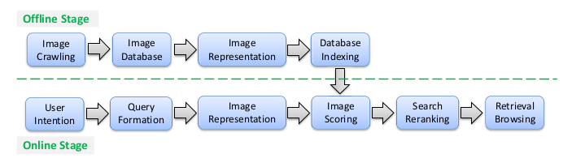

# 2003-2016 CBIR论文分类、评估及研究方向

## 简介

* 传统的CBIR只对图像的元信息建立索引
* 两大挑战：
	* 意图鸿沟（Intention Gap）：用户的意图 --- 表达出的Query 之间的差异
	* 语义鸿沟（Semantic Gap）：高层语义 --- 低层视觉特征 之间的差异
* CBIR的两个重要先驱方法
	* [SIFT](https://www.cs.ubc.ca/~lowe/papers/ijcv04.pdf)
		* 拥有局部不变性的视觉特征：旋转、缩放、光线
	* [BoW](http://www.robots.ox.ac.uk/~vgg/publications/papers/sivic03.pdf)
		* 通过量化局部特征得到图片的稠密表示，能套用倒排索引
* CBIR的三个重要问题，所有的研究都在对这三个问题作出贡献
	* 图像表示
	  * 区分相似与不相似的图片（discriminative）
	  * 充分表示图片内容（descriptive）
	  * 拥有局部不变性
	* 图像存储
	  * 倒排索引
	  * Hash技术
	  * 方法：视觉字典、特征量化、空间上下文编码, etc.
	* 图像相似度衡量
	  * 可看作不同的kernel的匹配方法

## PipeLine

* 五大模块：
  * [查询形式](#查询形式)
  * [图片表示](#图片表示)
  * [索引](#索引)
  * [相关度打分](#相关度打分)
  * [重排序](#重排序)
* 图像表示模块线上和线下通用

## 查询形式

* 文本：关键词
* 示例图片：最直观
* 手画图：最能比表达用户语义，用户难画，图片都得映射成手画图
* 颜色分布图：相近的颜色，不易处理光线变化
* 文本分布图：场景检索
* 目前都是单图检索，还可以有多图联合检索（视频）

## 图片表示

[特征抽取](#特征抽取)

[视觉字典学习](#视觉字典学习)：构建视觉词汇

[空间上下文编码](#空间上下文编码)：构建视觉短语

[特征量化](#特征量化)：分配视觉词汇给每个特征

[特征聚合](#特征聚合)：将多个局部特征聚合成一个`定长`向量

### 特征抽取

* 手工特征
  * 颜色、形状、纹理、结构
  * [GIST](https://ieeexplore.ieee.org/stamp/stamp.jsp?tp=&arnumber=4042704)
    * `广泛用于ANN算法中`，是一种`全局特征`
    * 但不适用于复杂背景
  * `局部特征`如SIFT
    * 关键点检测
      * 各种检测器：DoG, MSER, Hessian affine, Harris Hessian, FAST
      * 不用检测器，稠密或均匀采样
    * 局部区域解释器
    * SIFT有各式各样的变种
      * SURF, root-SIFT, binary-SIFT etc.
* 学习特征
  * 预测图片的属性特征得分
    * 属性词表、图片的风格
    * 优点：能表达图片的语义
    * 缺点：词表很难设计完整、上千种属性的分类计算量也很大
  * 用主题模型pLSA和LDA获得语义编码
  * 用`深度学习`的方法获得语义编码
    * 全局特征：AlexNet, VGGNet, etc
    * 局部特征
      * 无监督的区域抽取：[selective search](http://huppelen.nl/publications/selectiveSearchDraft.pdf)
      * 在每个区域里抽取特征
        * CNN抽取物体检测Region的特征（图片4方向旋转，取最高分)
        * RMAC([用了RPN网络](https://arxiv.org/abs/1604.01325))
    * 上述的特征全都是从`分类任务`中抽取的，得到的特征不能完整地表示图像，最好能直接从`检索任务`中学习，`为了摆脱分类任务`:
      * [LandMark检索](https://arxiv.org/pdf/1404.1777.pdf)：只专注于地标的检索，分类直接设置为地标（即检索的对象）
      * [无监督patch-level卷积网络特征](https://hal.inria.fr/hal-01207966/file/deep_patches.pdf)
      * [二进制编码](https://pdfs.semanticscholar.org/a71d/d6e9a0b1c2b3aee7f8d39446051b6638fa22.pdf)：分解训练图像的相似矩阵，端到端的方式
      * [三元损失，更短的二进制编码](https://arxiv.org/abs/1504.03410)

### 视觉字典学习

* 将局部特征集合转化为一个定长的向量：BoW, VLAD, Fisher Vector, etc
  * 视觉词汇：每个局部特征
  * `视觉字典：训练集上得到的所有词汇的集合`
* 生成视觉字典最直观的方式：K-Means
  * 把聚类中心当作视觉词汇
  * 改进
    * 层次K-Means，减少计算的复杂度
    * K-Means中寻找与最近的中心点最耗时，采用ANN的方式
      * 快速分配：K-D Tree
      * 超球体上以半径r采样，每个采样的特征作为视觉词汇
    * 通过图的密度计算视觉词汇之间的相似度，构建词表（SME）
* 在Bow模型中，能直接将视觉特征转换成视觉词汇ID，`不需要显示定义视觉词汇是什么`，这个过程可以看作是`量化`或`Hash`
  * 与生成视觉词典的方法不同，这类方法无需显示训练，只是`启发式`地定义视觉词汇
  * 局部敏感Hash（LSH）
    * 基于PCA的二进制编码排序，二进制的前几位看作视觉词汇ID，同ID分组
  * SIFT转为256位二进制签名
    * 从256位中选32位出来作为视觉词汇建立索引
    * 缺点：余下的每个特征都要在倒排索引里存224位，耗存储
  * SIFT转为128位向量（sketch embedding）
    * 分成4段，每一段在后来建立索引的时候都看作一个视觉词汇
  * 可扩展的级联Hash（SCH）
    * 用级联的方式，在局部解释器的主成分上量化处理

### 空间上下文编码

* 空间上下文能进一步加强对图像的表达
  * 图像中的对齐、缩放、关键点距离
  * 有了视觉上下文，更能区分视觉词汇
  * 相当于`视觉短语`
* 松散的空间一致性
  * `空间上的邻居`可以加强非视觉词汇的过滤
  * 用周围的15个最近邻居检查特征点是否匹配
  * 但这种松散的结构容易受到噪音的影响
* 用`距离度量`对局部空间上下文特征分组建模时生成视觉字典
* 更新`词汇树`
  * 解释器上下文加权（DCW）：基于词汇树解释器量化路径的频率减小信息量少的特征的权重
  * 和空间上下文加权（SCW）：利用高效的空间上下文统计信息保存信息量丰富的局部特征
  * 通过`编码`空间上下文特征构建空间关系树字典
* 用`多模型`，从一个关键点中抽取多个特征，用于上下文Hash
  * 几何最小Hash构建可重复的hash key
  * 在MSER（maximally stable extremal regions）区域中打包一束特征
    * MSER区域：区域内的强度函数极值
    * 基于阈值分割定义边界
    * 这一束特征通过`共享的视觉词汇数量`以及`匹配上视觉词汇的相对顺序`来比较
  * 序列特征（ordinal measure， OM）
    * 从空间邻居中抽取序列特征
    * 判断是否低于阈值来验证空间一致性
* 空间金字塔匹配
  * 用两个系列的有序bag-of-feature对全局空间上下文建模
  * 两个系列：线形投影、圆形投影
* 人脸检索
  * 上述方法都无法捕获独一无二的人脸特征
  * 用同一个人在不同姿势、光影下的多个样本进行训练，构建视觉字典
  * 一个视觉词汇有两部分组成：人ID + 位置ID

### 特征量化

* 最基本的方案：NN, ANN, K-D Tree, K-D forest, random seed
* 字典将特征空间划分成不重叠的单元，特征量化决定了每个特征向量应该放入哪个单元中
  * `Hard Manner`容易引起量化误差：
    * 当特征字典很`大`时，特征空间被分的很`细`，靠近分割边界的`相似特征`容易分到`不同的单元`里
    * 当特征字典很`小`时，特征空间被分的很`粗`，`不相关的特征`很可能也会分到`相同的单元`里
* `Soft Manner`减小量化误差
  * 将特征向量映射成几个视觉词汇的加权和（很大的视觉字典）
    * Database Feature和Query Feature都这样映射非常耗内存
    * 因而只在Query Feature上做这样的映射
    * K-means得到词汇字典，自底向上生成两层的词汇表树
  * 较小的视觉字典
    * 用汉明编码（对称或非对称）把SIFT特征向量转为视觉词汇
    * 训练中位数向量：每个维度取Median
    * 新的特征转为低维的视觉词汇向量后和中位数向量生成二进制签名进行比较
      * eg：大于median为1，小于median为0
* 上述方法均基于`单个视觉词表`
* 多视觉词表
  * 存在`词表相关性`的问题
  * 贝叶斯词表合并方法
    * 减少出现在多个词表中的词权重
    * 从概率的角度以及图像级别与特征级别联合相似度的角度进行建模
* 局部解释器常常和ANN相关，有很多Hash算法能实现ANN
  * LSH, multi-probe LSH（多指针）, kernelized LSH（核）, semi-supervised hashing method（SSH，半监督），spectral hashing（谱Hash），min-Hashing, 迭代量化, random grid，bucket distance hashing (BDH)，查询驱动的迭代近邻图搜索，线性距离维护Hash
  * Hash方法要么只应用于全局特征，要么只应用于局部特征
  * 局部特征Hash的缺陷
    * 有多个Hash table时，每个特征需要被索引好几次，耗存储
    * 每个都要和Query比一次距离，不适于大规模检索
    * 查询敏感
  * 乘积量化（PQ）
    * 两种优化方法
      * 非参数化：$\epsilon$-neighbourhood
      * 参数化：粗粒度建索引，细粒度匹配
  * 直接把SIFT特征划分为正规的格子在CBIR中效果很差

### 特征聚合

* Bow (词袋模型)
  * 把局部特征当作高维的二进制向量，每个维度代表是否出现了该视觉特征
  * 向量长度会等于视觉字典的词表长度
  * 生成的向量很稀疏，易于构建倒排索引
* VLAD (vector of locally aggregated descriptors)
  * 基于K-means量化，积累特征量化成视觉词汇的残差，连接积累的向量成一个定长向量
  * VLAD继承了SIFT的很多重要属性，已有改进如下
    * 中间正则方案实现多空间VLAD表示
    * 三角测量编码方案 + 平等聚合技术 （多特征：减少计算量）
    * max-pooling 实现稀疏编码
    * 增加隐层词表使得残差向量的聚合变得更均匀
    * 传统的VLAD为解决局部锢囚和背景杂乱的问题牺牲了灵活性：分组聚合
* Fisher Vector based (用Fisher核)
  * 是一种生成模型
  * 用log似然函数的梯度把特征向量集合表示成一个定长向量
  * 采用GMM（高斯混合模型）聚合局部特征
  * Fisher vector可以认为是VLAD和Bow的泛化表示
    * 如果只保留GMM权重的log似然梯度，则退化成了soft的Bow
    * 如果只保留GMM均值向量的log似然梯度，即得到了VLAD表示
  * 只要用了GMM，视觉字典就会比较小，生成的向量也不再稀疏：先降维再PQ量化
* `上述方法都是基于局部手工设计的特征如SIFT`，还可以使用深度学习得到的高维抽象特征
  * 不同卷积层池化后的CNN特征
  * 最后一个卷积层的CNN特征
  * `证明：这种在DL特征上采用池化加和的聚合方式具有很好的判别性，效果也是最佳的`

## 索引

## 相关度打分

## 重排序

## References

[Recent Advance in Content-based Image Retrieval: A Literature Survey](https://arxiv.org/pdf/1706.06064.pdf)

