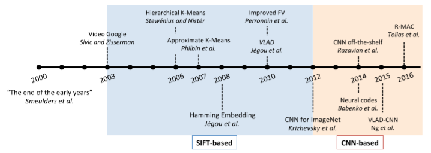

# 摘要 & 简介

* SIFT：（按视觉字典分）

  * 大：BoF的稀疏性和`视觉词汇的高区分度`
  * 中：BoF的稀疏性和`视觉词汇的低区分度`，准确率和效率间的权衡
  * 小：视觉词汇少于几千个，稠密向量在降维和编码之前生成

* CNN：（按模型分）

  * 预训练模型：直接使用预训练好的CNN模型，只将图像输入到网络中一次就可以获取特征向量
  * 微调模型：训练图像与目标数据具有相似的分布的训练集上，对CNN模型进行微调
  * 混合模型：基于`图像块(image patches)`的方法则是将图像多次输入到网络中，类似于SIFT

* 专注于`实例级的图像检索任务`

  * 任务定义：
    * 给定一张物体、场景、建筑类型的待查询图片，查询出包含拍摄自不同角度、光照或有遮挡的，含有相同物体、场景、建筑的图片
    * `不同于类别检索任务，因为后者的目标是检索出同类别的图片`

  

* 特征量化：

  * 硬量化：将一个特征量化为1个最近的视觉词汇
  * 软量化：将一个特征量化为几个最近的视觉词汇

* 未来发展

  * 通用实例检索：需要引入大规模图像数据集
  * 专用实例检索

# SIFT

### 小码本

* 含几千、几百甚至更少的视觉词汇（eg：64，128，256）
* BoW、VLAD、FV
* 流程：生成码本 + 特征量化（ANN）
* 优点：
  * 码本生成以及编码算法的时间复杂度不高
  * 小规模码本使得相对复杂的和存储信息的方法可以在这上面使用

### 中码本

* 含10K到200k个视觉词汇
* 汉明编码
* 流程：生成码本 + 特征量化 + 汉明编码

### 大码本

* 含1百万个甚至更多的视觉词汇
* HKM、AKM
* 流程：生成码本 + 特征量化（ANN） + 特征加权（TFIDF）+ 倒排
* 关键：平衡`量化误差`和`计算复杂度`

# CNN

### 预训练模型

* 聚合为全局表示，目前采用了两种策略：

  * 编码：因为和SIFT类似，可以直接套用BOF、FV、VLAD

  * 直接池合并：MAC、RMAC

### 微调模型

* 优点：
  * 图像特征以端到端的方式生成，网络将产生最终的视觉表示，而不需要额外的显式编码或合并步骤（`即聚合成一个特征向量`）
* 用于微调的CNN结构主要分为两类
  * 基于分类的网络
  * 基于验证的网络 (`应用更为广泛`)
    * 验证网络可以使用孪生网络（siamese network）结合 pairwise loss 或 triplet loss

### 混合模型

* 使用多网络传递方式：
  * 许多图像块（image patches）从输入图像中获得并被输入网络中进行特征提取，再编码、池化
  * 混合方法可被视为从SIFT-到基于CNN的方法的过渡方法，除了将CNN特征提取为局部描述符之外，它在所有方面都类似于基于SIFT的方法
* 缺点：效率比单通传递更低
* 优点：CNN一类的区域特征在除模糊图像之外要优于SIFT描述符
* 分类：
  * 网格化图像块 ：滑动窗口
  * 具有不变性的关键点、区域检测器
  * Region Proposal (RPN)

# 方法比较

* 准确率比较
  * 在基于SIFT的方法中，中码本表现要优于小码本
  * 微调的模型在特定任务（如地标、场景检索）中的有优势
* 效率比较
  * 特征提取
    * SIFT：CPU提取640×480大小的图像需1s-2s
    * CNN：在TitanX上通过VGG16网络对一个224×224和1024×768的图像进行单向传递分别需要0.082s和0.347s
    * 在GPU上二者都能快速提取特征
  * 检索时间
    * ANN用于“SIFT大码本”，“SIFT小码本”，“CNN预训练模型”和“CNN微调模型”时都相当高效
    * 中码本的效率较低，因为它的倒排索引与大码本相比包含更多的key
    * 混合方法的检索复杂度会因为多对多匹配策略而效率低
  * 训练时间
    *  用AKM或HKM训练大码本或中码本通常需要几个小时，使用小码本可以缩短训练时间
    * 微调模型，Gordo等人在一块K40 GPU上花费了5天训练三元损失模型
    * 在训练方面，使用直接池或小码本的效率更高
* 重要参数
  * 码本规模：
    * MAP通常随着编码本增大而增加，但当码本足够大时MAP值可能达到饱和。这是因为更大的码本提高了匹配精度，但是如果它太大，召回率变低，导致性能饱和甚至损害性能
  * 维数对紧凑向量的影响
    * 检索精度通常在较大的尺寸下较为稳定，而当维数低于256或128时精度迅速下降
    * 区域提取方法在各种特征长度下都非常出色
* 讨论
  * 表示向量长度固定的CNN方法几乎在所有的基准数据集上的性能都占有优势
  * 优先使用CNN的情况
    * 对于`特定`对象的检索（例如建筑物、行人），当提供的训练数据足够时，可以充分利用CNN网络嵌入学习的能力
    * 对于`常见`的对象检索或类检索，预训练的CNN模型具有竞争力
  * SIFT更优的情况
    * 在输入是`灰度图像`时，CNN可能不如SIFT有效，因为SIFT是在灰度图像上计算而不诉诸于颜色信息
    * 在`小对象检索`中或当查询对象被严重遮挡时，使用诸如SIFT之类的局部特征是更好的选择
    * 在书籍、CD封面检索等应用中，由于丰富的纹理

# 参考文献

[SIFT Meets CNN: A Decade Survey of Instance Retrieval](https://arxiv.org/pdf/1608.01807.pdf)